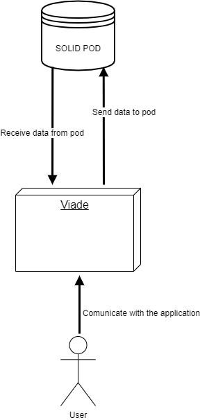
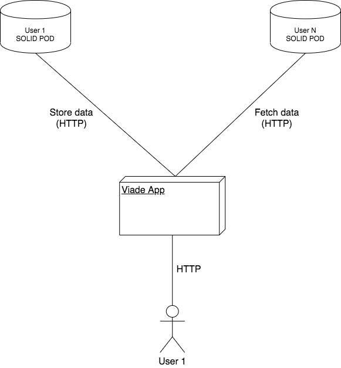

[[section-system-scope-and-context]]
== System Scope and Context

In this part we talk about the communication in two contexts, one is business context where we specifies 
communication partners with explanations of the domain and some schemes and the other one is the technical 
context where we do the same in a technical context.

=== Business Context

In this part we use an scheme to specify the communications of the person who is using the application with the application. First of all he 
logins with Solid, then when he is inside the appication we have to commuicate with the pods to store or see routes, if we want to 
send any route we have to communicate with the other pods of the users.

|======================
|Object   |Description  
|User | Communicate with the application
|Viade | Is the application itself.                   
|Solid Pod | It will contain all the data from the given user.
|======================

=== Technical Context

In this part we have to specify the same we had in previous point but with a technical view.

|======================
|Object   |Description  
| User | Communicate with the application
|User POD | Represents the communication will be made using internet with the HTTP protocol.                   
|Pod | This is a Solid Pod and it will contain all the data from the given user     
|SOLID | Is the server in which the Solid pods are stored
|======================

